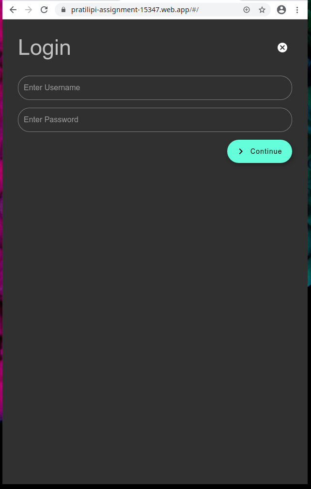
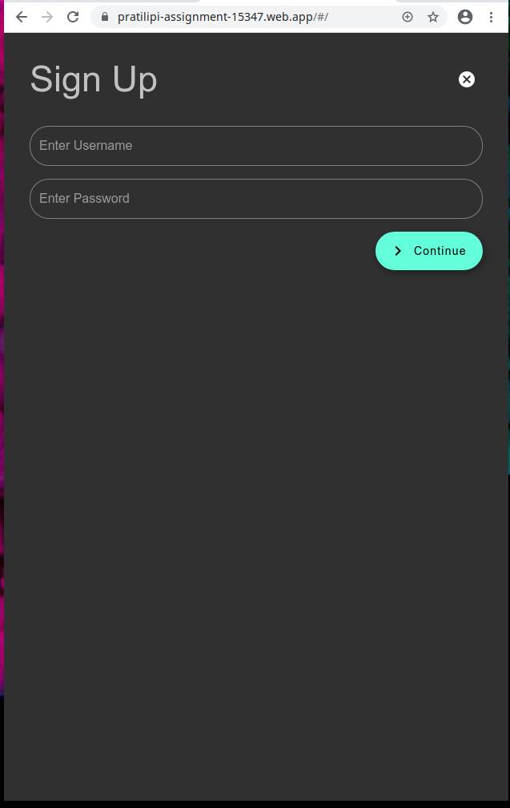
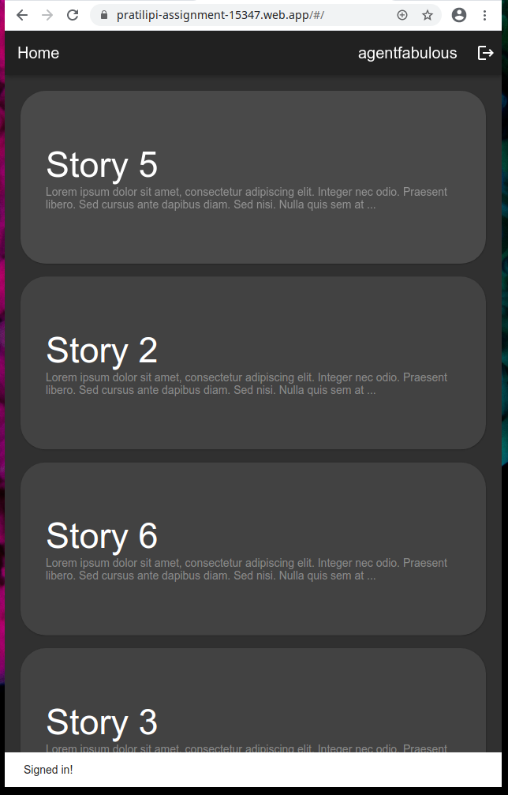
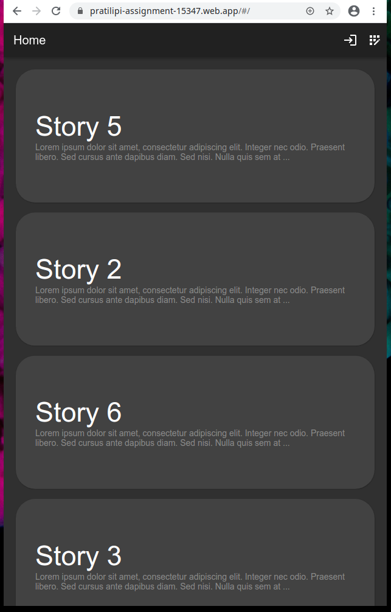

# Placement assignment for pratilipi.com

- The following project was written with Flutter Web running against Cloud Firestore for data storage.

## Deploying
- Ensure you have Android Studio and Flutter SDK (branch beta, dev or master) installed
- Check if 'chrome' is listed in `flutter devices`, if not, export `CHROME_EXECUTABLE` in env.
- Create a new Firebase project
- `$ firebase init`
- Select sign in, select the created project, select hosting, and don't overwrite index.html if prompted
- `$ cp web/index.html.sample web/index.html`
- Modify web/index.html to add your Firebase API keys
- `$flutter build web`
- `$firebase deploy`

## Background
- While Flutter is mostly popular for creating mobile applications, recent developments to the Flutter Web project have made it possible to quickly prototype a PWA (Progressive Web App) that can be easily adopted to mobile, or vice-versa. The database consists of 2 Collections, namely "Stories" and Users", with each entity representing a "Story" and "User" respecitvely.

Story:
```
class Story {
  Story({
    this.title,
    this.content,
    this.viewing,
    this.allReads,
  });

  String title;
  String content;
  List<String> viewing = [];
  List<String> allReads = [];

  ...
}
```
User:
```

class User {
  User({
    this.username,
    this.salt,
    this.hash,
    this.token,
  });

  String username;
  String salt;
  String hash;
  String token;
  ...
}
```

## Security
- As can be seen, each user's password is not stored in plain text. Each user has a unique salt, and that salt generates a hash. This hash is checked against the database, and if it matches, the user is authenticated.
- The application also allows non-authenticated users to view content. Later, authentication can be used for submitting new stories.
- The client also stores a token in a cookie that is used to return back without the need of performing authentication again. This token expires after 30 days.
Password data generator:
```
    var salt = Salt.generateAsBase64String(10);
    var hash = PBKDF2().generateBase64Key(password, salt, 1000, 32);
```

## User Presence
- When a user opens a story, their id gets added to a Set (allReads). If the user is authenticated, their username is used as an id. If not, a temporary if is generated which is stored in a cookie.
- User Presence is managed by a simple js function, which is called from the dart code:
```
function checkFocus() {
  var info = document.getElementById("main");

  return document.hasFocus()
}
```
- This is then updated on the database. Many checks are in place for this to work correctly.

## Screenshots
| Login | Sign Up | Signed In |
| :---       | :---         | :---       |
|  |  |  | 

| Home | Story |
| :---       | :---           |
| |  |

Home Full:

